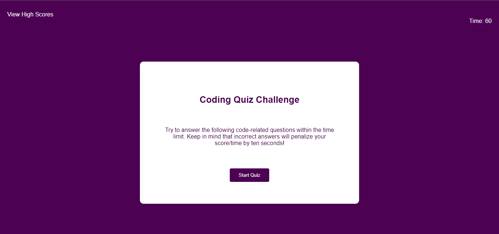

# Coding Quiz Challenge

This is a coding quiz challenge that tests your knowledge of HTML, CSS, and JavaScript.

## How to play

Using the following link:  
[Take the coding quiz challenge](https://acantu9.github.io/code-quiz/?) 

1. Click the "Start Quiz" button to begin.
2. You will be presented with a series of multiple-choice questions.
3. Select the correct answer by clicking on the corresponding button.
4. You have 60 seconds to complete the quiz.
5. Each incorrect answer will penalize your time, by 10 seconds. Each correct answer will increase your time, by 10 seconds.
6. Your final score will be the remaining amount of time you have left at the end of the quiz and will be displayed.

## Credits

The following resources were used in creating this project:  
[YouTube Tutorial](https://www.youtube.com/watch?v=PBcqGxrr9g8)  
[BlackboxAI](https://www.useblackbox.ai)  
[Xpert Learning Assistant](https://bootcampspot.instructure.com/courses/4010/external_tools/313)  
[Module 4 Challenge Review](https://zoom.us/rec/play/TLgbY1Z0BF-wLMjSlwPy5mJUl9n_wzBijZOHygA3XORGcAvPL33bjQ_Ktcwyv0OgvQIeZWF_MD3d8o-5.JCB0qwk9xB9VSzuM)

And finally, I would like to express gratitude for my tutor, Chris B.

## License

Please refer to the LICENSE in the repo.
